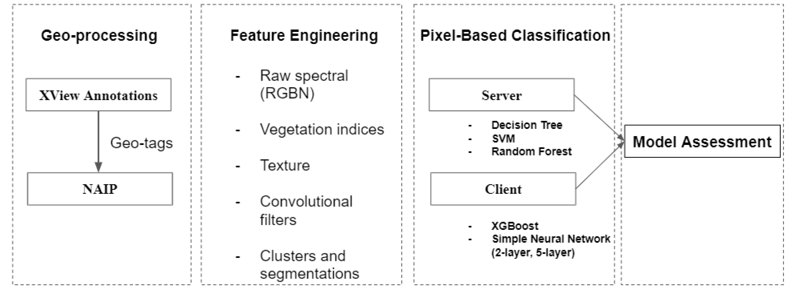
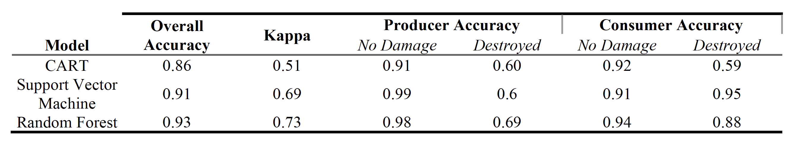
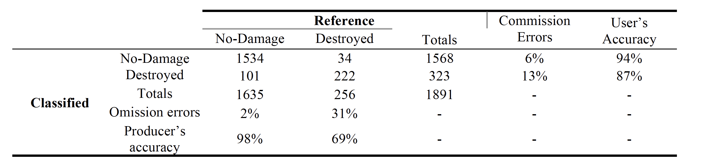
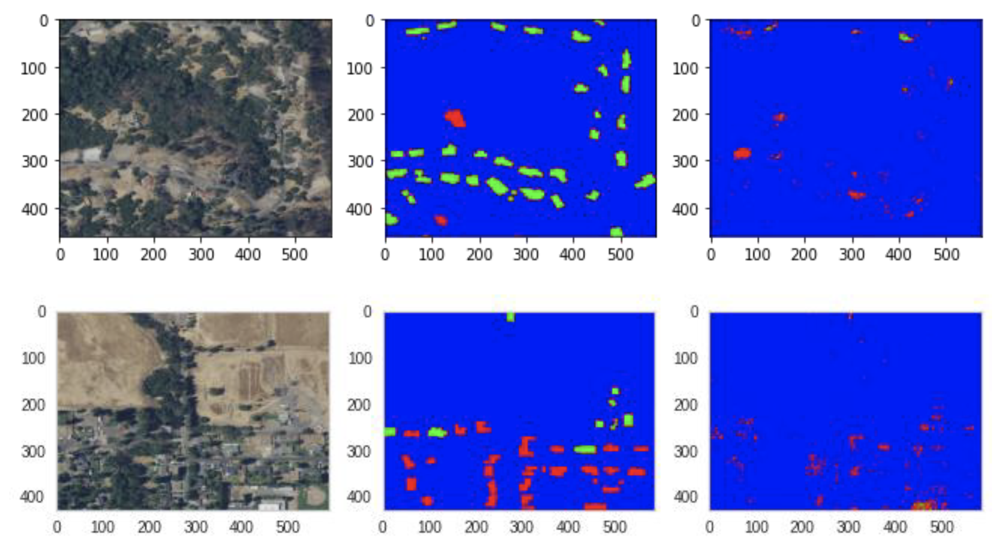
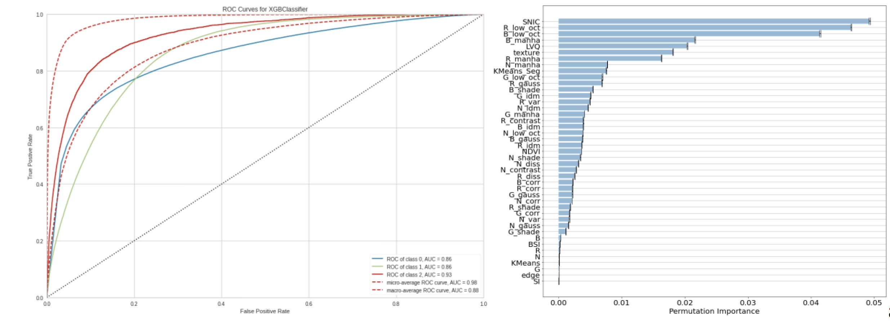

# Comparative Assessment of Building Damage from High-Resolution Satellite-Based Images

## Table of Contents  
- [Project Description](#project-Description)  
- [Datasets](#datasets) 
- [Modeling Framework](#modeling-framework) 
- [Results](#results)
- [Feature Importance](#feature-importance)

___

## Project Description
In this project, we compared different machine learning algorithms for image classification to develop a general framework for fire-induced building damage evaluation from high-resolution remotely sensed imagery in California. Our results showed promising utility for machine learning models, based on spectral, texture, and convolutional features, in the applications for post-fire building-damage monitoring. For the binary classification scheme, the Random Forest (RF) classifier performed the best with an overall accuracy of 93% and a Cohen’s kappa of 0.73. For the multiclass scheme (i.e without vegetation mask), XGBoost performed better than the 5-layer neural networks. It is able to detect building areas but is less accurate in predicting damage when compared with the binary case. Feature engineering also proved to be an essential step in model building. Particularly, the addition of SNIC segmentation which greatly aided in the improvement of overall model performance for both RF and XGBoost classifiers.

## Datasets

The xView 2 Building Damage Assessment dataset provides annotated building footprint polygons with 5 damage classes (minor-damage, major-damage, destroyed, no-damage, un-classified) with corresponding RGB images at a resolution below 0.8 meter ground sample distance (GSD).

<figure class="image">
  
  <figcaption>Figure 1. XView dataset overlaid on top of NAIP imagery in study region (a) Southern California (i.e. Woolsey fire) and (b) Santa Rosa (i.e. Carr fire). </figcaption>
</figure>

The National Agriculture Imagery Program (NAIP) satellite images are acquired at 0.6-1m resolution GSD with Red, Green, Blue (RGB) and near-infrared band (NIR). Since 2009, NAIP imagery has been acquired every three years. Based on fire events instances focused in this study, NAIP images were obtained for pre-fire condition in 2015 and post-fire conditions in 2018. 

## Modeling Framework 

<figure class="image">
  
  <figcaption>Figure 2. High-level project pipline. </figcaption>
</figure>

To inform the final classification outputs, a number of indices were derived taking advantage of NAIP’s RGB & NIR bands, along with object-based layers including segmentation and geometric feature extractions (e.g. canny edge detection, compactness, etc.). Both pre- and post-fire data were selected as inputs in the model to inform image changes of damaged areas.

## Results 

For the binary classification with mask, random forest classifier performs the best (Table I) with an overall accuracy of 93% and a Cohen’s kappa of 0.73.

<figure class="image">
  
  <figcaption>Table I. Model performance metrics for CART, SVM, and RF classifiers including the overall accuracy, Kappa, Producer, and Consumer accuracies. </figcaption>
</figure>

<figure class="image">
  
  <figcaption>Figure 3. (a) Visually illustrates the Random Forest classification output (b) Annotated dataset from XView for comparative purposes. </figcaption>
</figure>

Producer and user accuracies of each class show
higher accuracy for no-damage areas relative to destroyed building footprints (Table II). Overall, a higher percentage of false negatives are seen with omission errors for destroyed class at 31% , while only 2% were observed in the no-damage class.

<figure class="image">
  
  <figcaption>Table II. Confusion matrix comparing Random Forest classified results with xView ground-based assessment results. </figcaption>
</figure>

For the multiclass problem without vegetation mask, XGBoost performs better than 5-layer neural networks although the latter has relatively higher overall accuracy (90.4% vs. 90.9%).

As for the neural networks, the 2-layer network has an accuracy of 80.3% but achieved better predictions than the 5-layer network when visually evaluated. However, the 2-layer network has the same problem as the XGBoost and omits more buildings.

<figure class="image">
  
  <figcaption>Figure 4. Predictions from XGBoost models. Left: NAIP images in RGB; Middle: ground truth annotations; Right: predicted buildings (red: no damage, green: destroyed buildings, blue: non-building). </figcaption>
</figure>

## Feature Importance 

Overall, important feature layers that contributed to the RF classifications include SNIC, bare soil index, shadow (B), gaussian low-pass filter (B), and local correlation (N). 

<figure class="image">
  
  <figcaption>Figure 5. Feature importance from (a) CART and (b) Random Forest </figcaption>
</figure>

Important features for XGBoost are SNIC segmentation and convolutions (shape and manhattan) of red and NIR channels. 

<figure class="image">
  
  <figcaption>Figure 6. Feature Importance and ROC Curve for the XGBoost model. </figcaption>
</figure>
